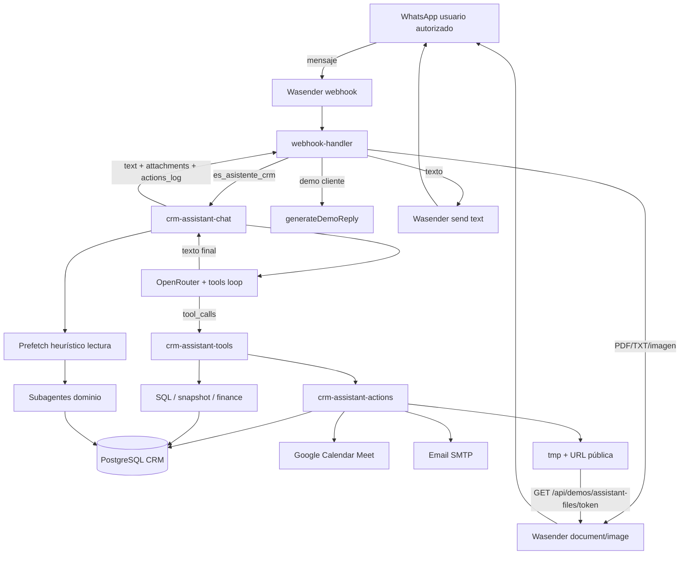

# Secretaria personal CRM (WhatsApp)

Arquitectura del asistente `es_asistente_crm` en Demos.

## Diagrama

## Flujo de una petición

1. Wasender entrega el mensaje → `handleDemoWasenderWebhook`.
2. Si el demo tiene `es_asistente_crm` y el teléfono está autorizado → orquestador secretaria.
3. Prefetch de lectura (salvo si parece escritura) + hasta 8 rondas de tools.
4. Escrituras: `confirm=false` → preview en WhatsApp → usuario dice sí → `confirm=true`.
5. Documentos: se publican en `/api/demos/assistant-files/[token]` y Wasender los descarga.
6. Se envía texto y luego cada adjunto.

## Capas

| Capa | Archivo | Rol |
|------|---------|-----|
| Entrada | `lib/demos/webhook-handler.ts` | Enruta, texto + adjuntos |
| Orquestador | `lib/demos/crm-assistant-chat.ts` | Prefetch, tools, anti-«voy a consultar» |
| Prompt UI-safe | `lib/demos/crm-assistant-prompt.ts` | Identidad secretaria |
| Ontología | `lib/demos/crm-assistant-ontology.ts` | Tablas / KPI / no mezclar estados |
| Tools | `lib/demos/crm-assistant-tools.ts` | OpenRouter schemas + execute |
| Subagentes | `lib/demos/crm-assistant-subagents.ts` | finance/comercial/proyectos/ops/marketing/cliente |
| Acciones | `lib/demos/crm-assistant-actions.ts` | Escritura + informes + email |
| Adjuntos | `lib/demos/assistant-attachments.ts` + API | URL temporal |
| Wasender | `lib/demos/wasender.ts` | text / documentUrl / imageUrl |

## Qué puede hacer

**Lectura:** overview, finanzas, comercial, proyectos, tickets, marketing, ficha cliente, banco, pipeline, facturas.

**Escritura (con confirmación):**
- Checklist inbox/santi/sergi
- Notas y estado de leads; alta contact+lead
- Responder / cambiar status de tickets
- Tareas de proyecto + status de proyecto
- Reuniones Google Meet
- Emails SMTP
- Informes / documentos TXT por WhatsApp

## Requisitos env

- `OPENROUTER_API_KEY`, `WASENDER_API_KEY`
- `NEXT_PUBLIC_BASE_URL` (obligatorio para documentos)
- Opcional Calendar: `GOOGLE_REFRESH_TOKEN`, `CRM_ADMIN_EMAIL`
- Opcional Email: `SMTP_HOST`, `SMTP_USER`, `SMTP_PASS`

## Activar

1. SQL `prisma/ALTER_DEMOS_ASISTENTE_CRM.sql` si falta la columna.
2. En Demos → crear/editar WhatsApp → marcar «Asistente personal CRM».
3. Autorizar tu número (no puede ser agente principal a la vez).
4. Re-toggle el flag si el prompt viejo no tiene el protocolo secretaria.
